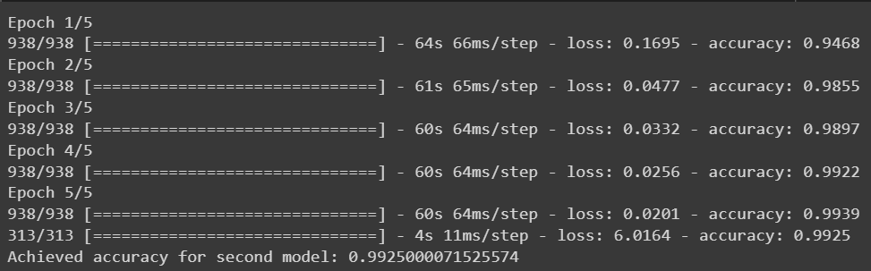

# MNIST

### The difference between *Simple_mnist* and *Double_mnist*

*Simple MNIST* is the folder containing the classic problem of identifying handwritten digits from 0 to 9. This project was done as a preparation for *Double MNIST*.
The data of this project contains 70 000 exemples of 28x28 pixels images representing the handwritten digits. The first 9 data points look like this : 

  

*Double MNIST* is the folder containing the project that we had to do in the *Machine Learning* class. Similar to *Simple MNIST*, we had to make a model that recognizes handwritten digits. However, the difference is that we had to identify the sum of two digits in each data point. Instead of having one digit per data point, each image had two digits side by side. The task given by our professor was as follows: "Given images each containing two digits, train a model that can recognize the sum of new examples of pair of digits". The problem was therefore a classification problem with 19 possible classes (from 0 to 18). The first 9 data points look like this:

  

 
N.B. : *Double MNIST* was done by me and a collegue. However, I did not post my collegue's work as to not claim credit for it. All code in this repository is mine. As instructed by our professor, we had to build 2 types of models and compare their accuracy. My collegue built the first type of model using *Logistic Regression* and I built the second type of model using *Neural Networks*. 

---

## *Simple MNIST*

The data is separated in 2 datasets : 60 000 data points in the training set and 10 000 in the testing set. The training set is used to train the model and the testing set is used to test the trained model to have an idea of the accuracy of said model. For this task, I built two *Artificial Neural Network*. The first model was a simple *Classical* model (containing only *dense* hidden layers) and the second model was a *Convolutional* model (containing *convolutional* hidden layers followed by *dense* hidden layers).

To put things into perspective, here is an image showing a basic *Classical Neural Network* :

  

The model that I built followed the same principles. However, the number of neurons in each layer of my model is different. After testing the data on the *Testing* dataset, the first model achieved an accuracy of 97.34% : 

  

The second model that I built was a *Convolutional Neural Network*. Here is an image showing a random *CNN* : 

  

Once again, my second model followed the same principles but was structured differently. After testing this model on the *Testing* dataset, the achieved accuracy was 99.25% (which is better than the first model) :

  

---

## *Double MNIST*

The *Double MNIST* project was much harder as it had a higher number of possible classes and data that was tagged the same way but did not look the same :
` 1 + 1 = 2 but also 0 + 2 = 2 ` 
Nevertheless, we still built a *Classical Neural Network* and a *Convolutional Neural Network*. For this project, the number of hidden layers was far greater in each model compared to *Simple MNIST*. This project was created on Kaggle by our *ML* professor. As datasets, we were given a *Training* dataset containing 50 000 tagged examples to train our model on and a *Testing* dataset containing 10 000 untagged examples to predict their classes. 

We had to submit our predictions on kaggle to receive a score for the accuracy of our model. However, we had a limited number of submissions possible. To increase our chances, we separated our training dataset in two : 80% of the points will be used to train our model and 20% of the points will be used to validate the model and get an approximation of the accuracy of said model. 

The submissions we delivered on Kaggle are the following : 

  

As you can see, the Logistic Regression model had an accuracy score of `9.5%` as it wasn't the best model for this task.

For the first *Neural Network* model, we built a *Classical Neural Network* with more layers and more neurons than the model for *Simple MNIST*. After running our model on the *Validating* dataset and changing our model multiple time, we hit a ceiling of achieved accuracy at `70%`. Because we knew that the second model would be better, we did not post our predictions on Kaggle.

For the second *Neural Network* model, we built a *Convolutional Neural Network*. Once again, the model was much more complex than the one in *Simple MNIST*. After running this model on the *Validating* dataset, we had and achieved accuracy of `~95%`.

Before the project was due, we had the idea to generate more data points. We figured that we could double our datapoints if we cloned the examples and switched the digits from left to right. For examples : `1 + 2 -> 2 + 1`. This works because addition is commutative. After doubling our dataset, we achieved a final score of `~96%`.

As you can see from our last submission, our final accuracy score was `96.54%`.
